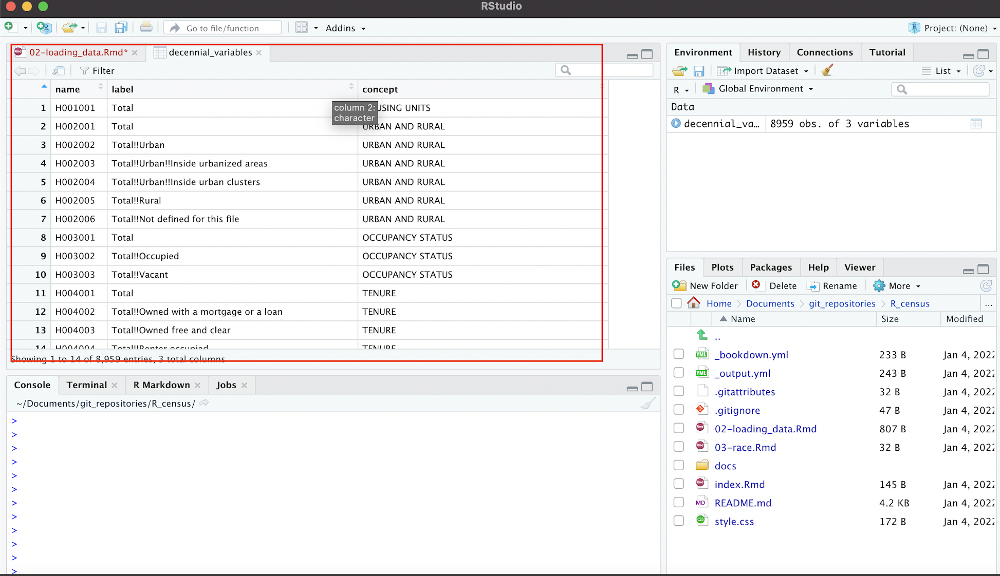

# Retrieve and Load Decennial Census Data into R Studio

## Load table of variables

```{r, echo=FALSE}
library(tidycensus)
library(tidyverse)
library(knitr)
```

We begin by loading a table of decennial census variables, and assigning it to an object named ```decennial_variables```:

```{r}
decennial_variables<-load_variables(2010, "sf1")
```

We can print this table to the console by simply printing the object name, ```decennial_variables```:

```{r}
# Print table of 2010 decennial variables to console
decennial_variables
```

To view this table in R Studio's data viewer, pass the object to the ```View``` function:

```{r}
View(decennial_variables)
```

When the data is open in the R Studio data viewer, it will look something like this:

```{r, fig.cap="Table of 2010 census variable descriptions and codes", echo=FALSE}

```

## Query the census API, and retrieve data using tidycensus

Now, let's generate a table of population by state, based on the 2010 decennial census, and assign this new dataset to an object named ```state_population_2010```:

```{r}
state_population_2010<-get_decennial(geography = "state", 
                                     variables = "P001001",
                                     year = 2010)
```

As with our table of variable descriptions (```decennial_variables```), we can view the data by typing the object name, which prints its contents to the console:

```{r}
state_population_2010
```

Recall that we can also bring up the data in the R Studio data viewer using the ```View``` function:

```{r}
View(state_population_2010)
```

```{r, echo=FALSE}
kable(head(state_population_2010, n=6))
```

## Modifying a census API call by altering arguments to the "get_decennial" function


