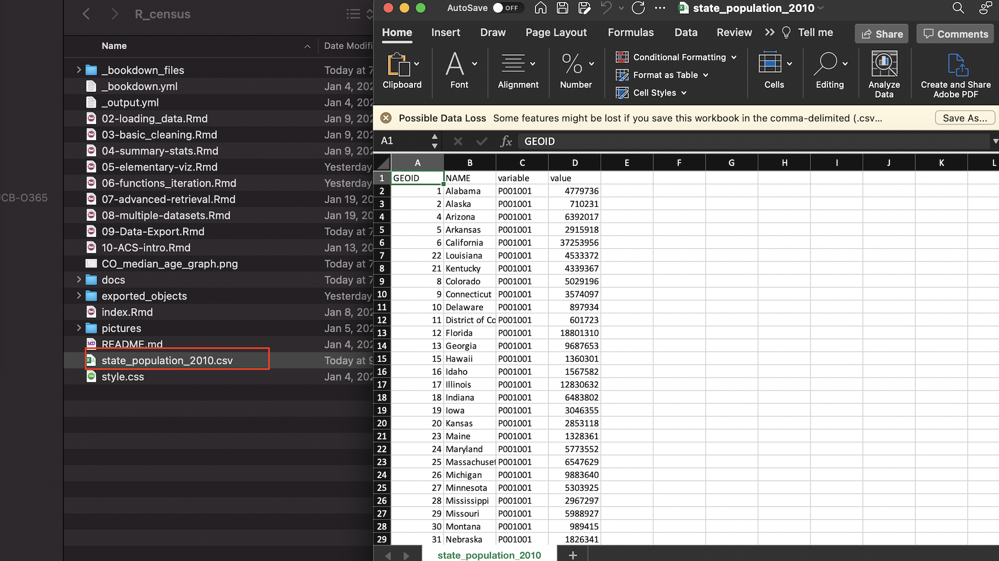
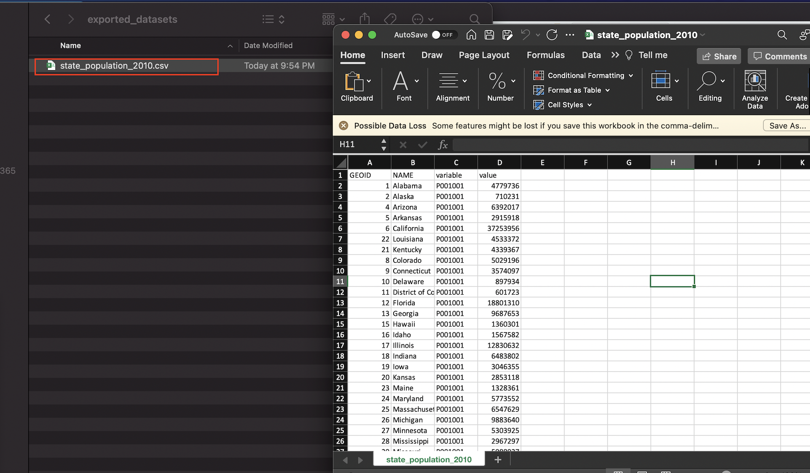

# Exporting R Objects

## Exporting a single object

### Exporting a single dataset to disk as a CSV file

```{r}
write_csv(state_population_2010, "state_population_2010.csv")
```

```{r, fig.cap="'state_population_2010' exported as CSV file to working directory", echo=FALSE}

```

```{r}
write_csv(state_population_2010, "/Users/adra7980/Documents/git_repositories/R_census/exported_objects/exported_datasets/state_population_2010.csv")
```

```{r, fig.cap="'state_population_2010' exported as CSV file to dedicated directory named 'exported_datasets", echo=FALSE}

```

### Exporting a single map to disk as a png, jpeg, or PDF file with ```tmap_save```

```{r, warning=FALSE, message=FALSE, fig.asp=0.5}
median_age_CO_map
```

```{r}
tmap_save(median_age_CO_map, "median_age_CO_map.png")
```

```{r}
tmap_save(median_age_CO_map, "/Users/adra7980/Documents/git_repositories/R_census/exported_objects/visualizations/median_age_CO_map.png")
```

```{r}
tmap_save(median_age_CO_map, "/Users/adra7980/Documents/git_repositories/R_census/exported_objects/visualizations/median_age_CO_map.pdf")
```

### Exporting a single ggplot visualization to disk as a png, jpeg, or PDF file with "ggsave"

```{r}
median_age_CO_cleaned_visualization
```

```{r}
ggsave("CO_median_age_graph.png", median_age_CO_cleaned_visualization)
```

```{r}
ggsave("/Users/adra7980/Documents/git_repositories/R_census/exported_objects/visualizations/CO_median_age_graph.jpeg", median_age_CO_cleaned_visualization)
```

### Exporting a single ggplot or tmap visualization with a graphics device

Exporting a single ```tmap``` visualization as a pdf file using a pdf device

```{r}
pdf("/Users/adra7980/Documents/git_repositories/R_census/exported_objects/visualizations/CO_median_age_graph.pdf")
median_age_CO_map
dev.off()
```

Exporting a single ```tmap``` visualization as a png file using a png device

```{r}
png("/Users/adra7980/Documents/git_repositories/R_census/exported_objects/visualizations/CO_median_age_graph.png")
median_age_CO_map
dev.off()
```

Exporting a single ```ggplot``` visualization as a jpeg file using a jpeg device

```{r}
jpeg("/Users/adra7980/Documents/git_repositories/R_census/exported_objects/visualizations/CO_median_age_graph.jpeg")
median_age_CO_cleaned_visualization
dev.off()
```

## Exporting multiple objects

### Exporting multiple csv files stored in a list

```{r}
population_rural_2000_2010_list_cleaned
```

```{r}
writeout_function<-function(object, filename){
  setwd("/Users/adra7980/Documents/git_repositories/R_census/exported_objects/exported_datasets")
  filename<-paste0(filename, ".csv")
  write_csv(object, filename)
}

filename_vector<-paste0("rural_pct_", names(population_rural_2000_2010_list_cleaned))
filename_vector


walk2(population_rural_2000_2010_list_cleaned, filename_vector, 
     writeout_function)
```

### Exporting multiple csv files stored as separate objects in the global environment

```{r}
state_total_2010<-get_decennial(geography="state", 
                                variables = "P001001",
                                year = 2010)

state_rural_2010<-get_decennial(geography = "state", 
                                variables = "P002005",
                                 year = 2010)

```


```{r}
# put objects to export in a named list
objects_to_export<-lst(state_total_2010, state_rural_2010)

# create filename vector
filename_vector<-names(objects_to_export)

# write out census datasets as CSV files
walk2(objects_to_export, filename_vector, writeout_function)
```

### Using a graphics device to export multiple objects from a list into a single PDF file

Use PDF viewer to write out multiple ```tmap``` visualizations stored in a list to a single PDF file

```{r}
pdf("/Users/adra7980/Documents/git_repositories/R_census/exported_objects/visualizations/age_maps.pdf")
county_age_maps_list
dev.off()
```

Use PDF viewer to write out multiple ```ggplot``` visualizations stored in a list to a single PDF file

```{r}
pdf("/Users/adra7980/Documents/git_repositories/R_census/exported_objects/visualizations/age_graphs.pdf")
county_age_graphs_list
dev.off()
```

### Writing out multiple "tmap" or "ggplot" objects as separate files

```{r}
viz_save_general<-function(plot, filename, extension){
  setwd("/Users/adra7980/Documents/git_repositories/R_census/exported_objects/visualizations")
  filename_string<-paste0(filename, extension)
  if(extension==".pdf"){
    pdf(filename_string)
  } else {
    if (extension==".png"){
      png(filename_string)
    } else {
      if (extension==".jpeg"){
        jpeg(filename_string)
      }
    }
  }
print(plot)
dev.off()
}

```

```{r}
# writes out tmap objects from "county_age_maps_list" as separate jpeg files

filenames<-paste0(names(county_age_maps_list), "_", "COUNTY_AGE_MAP")
inputlist<-list(county_age_maps_list, filenames, ".jpeg")
pwalk(inputlist, viz_save_general)
```

If you want PDFs of the maps in ```county_age_maps_list", then...

```{r}
# writes out tmap objects from "county_age_maps_list" as separate PDF files
filenames<-paste0(names(county_age_maps_list), "_", "COUNTY_AGE_MAP")
inputlist<-list(county_age_maps_list, filenames, ".pdf")
pwalk(inputlist, viz_save_general)
```

We can use the same function (```viz_save_general```) to write out ```ggplot``` objects as separate files with a specified file extension. For example, to write out the graphs in ```county_age_graphs_list``` as PDFs:

```{r}
filenames<-paste0(names(county_age_graphs_list), "_", "COUNTY_AGE_GRAPH")
inputlist<-list(county_age_graphs_list, filenames, ".pdf")
pwalk(inputlist, viz_save_general)
```

To write out the graphs in ```county_age_graphs_list``` as png files, simply modify the file extension:

```{r}
filenames<-paste0(names(county_age_graphs_list), "_", "COUNTY_AGE_GRAPH")
inputlist<-list(county_age_graphs_list, filenames, ".png")
pwalk(inputlist, viz_save_general)
```


